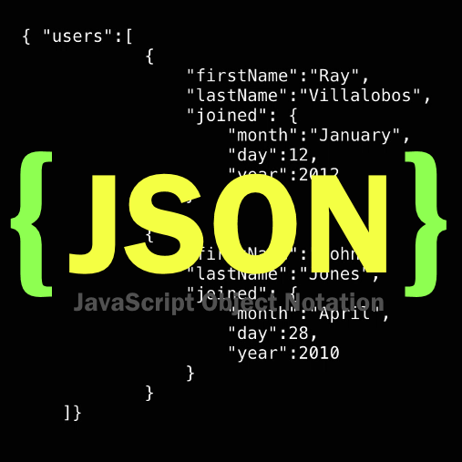
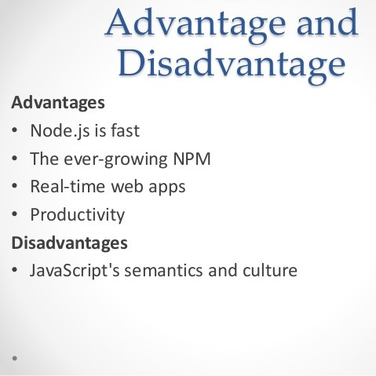

  ## JavaScript is one of convenient high level of interpreted programming language that I have learned so far. 
What I learned first about is Java programming language. 
When I learned the language, I was only capable of coding basic programs such as print out functions and arithmetic operations. 
Through the Java learning class, I could experience JavaScript a little bit. 
My first impression of JavaScript was complex because unlikely Java working on IDE, JavaScript runs on web applications. 
	
  ## Since I learned Java, I have studied for C and C++ programming language. 
Throughout the process of learning the two programming languages, I got to know about backgrounds of C and C++ and
how they are related to other programming languages such as JavaScript and Python.
	
  ## I have learned only three programming languages so far, from my perspective, however,
What I can tell is JavaScript is way easier to use as a client-side scripting language.
JavaScript is also running very fast because all the functions are run right away regardless of waiting for an answer from the server. 
	
  ## I’m still trying to figure out what JavaScript has advantages because I’m newbie. 
Unlike what I said about JavaScript the above, What I actually felt, by coding in JavaScript, how JavaScript is both good and bad. 
As one of software engineers, working on JavaScript makes engineers’ life easier 
because JavaScript is an objected-based scripting language that means giving more control to the users. 
JavaScript is more useful situations such as building web apps because it is the only language. 

  ## From the other side of my perspective as a software engineer, JavaScript is worse than other languages in repetitive code. 
It is hard for software engineers to count how many brackets has been used whenever they use repetitive code. 
What I personally worry about learning JavaScript that makes code easier is 
that engineers might forget where the language started from and how important to learn fundamental languages 
such as C programming language because of only reason that it’s hard to learn. 
	
  ## WODs to me is quite stressful because I am not skilled engineer yet that can code a program in time. 
However, practicing  WODs completely offers me an opportunity to learn how to code in a good way 
and to improve my skills and myself as a software engineer
