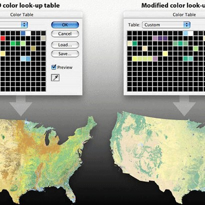

GIF employs a variety of ways to store image data. One of them is use of "color table," or a color palette. First, you define an index for each color you will use, e.g., 0 for white, 1 for black, 2 for blue, and so on. Based on this table, you can encode each pixel with the corresponding color index.

Modifying the color table

When you open the GIF file, your computer actually draws the image based on the color palettes in the file. What if we replace them with other palettes? Let's say we hack and modify the color table, and change white (FF FF FF) to black (00 00 00), red (FF 00 00) to cyan (00 FF FF), blue (00 00 FF) to yellow (FF FF 00), green (00 FF 00) to magenta (FF 00 FF). The resulted image from the one above is like this.

In this project, I gained experience with dealing with Image file and got more interested in C++. 

```java
void modifying(unsigned char imageData[])
{
    int i;
    int op;
  
    for(i = 13; i < 25; i = i+3)
    {
        if(((imageData[i] & op) == op) && ((imageData[i+1] & op) == op) && ((imageData[i+2] & op) ==op))
        {
            imageData[i] = imageData[i] >> 2;
            imageData[i+1] =imageData[i+1]>>2;
            imageData[i+2] = imageData[i+2] >>2;
        }
  
        else
        {
            imageData[i] = imageData[i] | 12;
            imageData[i+1] = imageData[i+1] ^ 160;
            imageData[i+2] = imageData[i+2] & 175;
        }
    }
}
```
