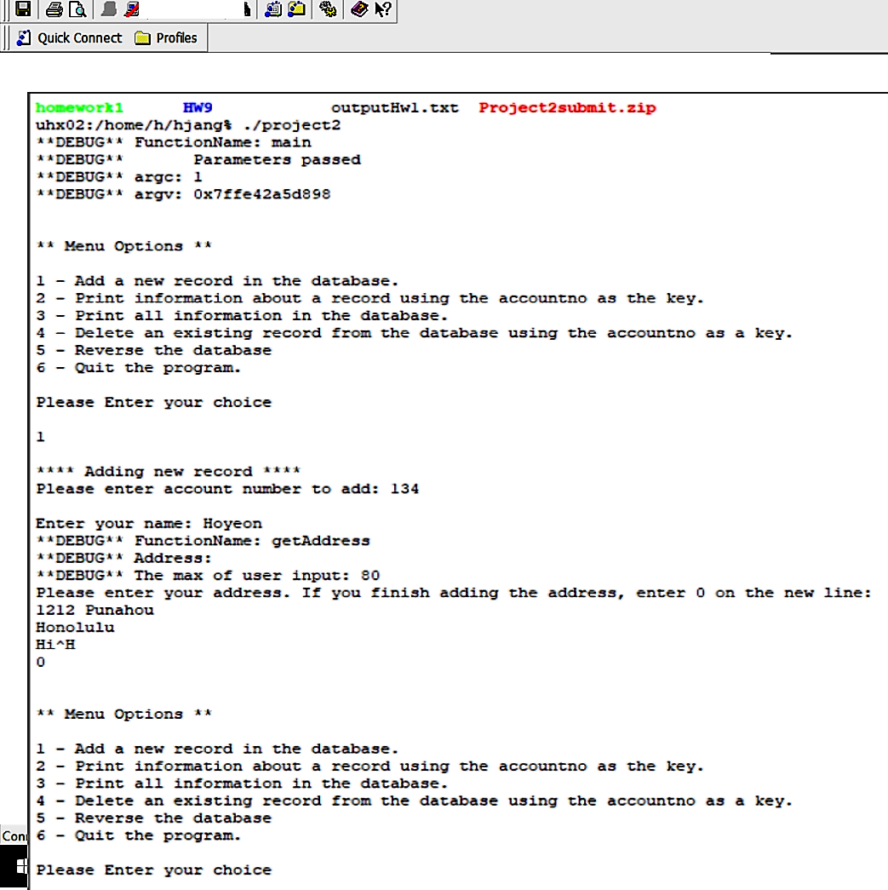

A user-interface which allows the user a menu of choices for a bank database application. The database contains the accountnumber, name, and address fields for each person.

Menu Options
The information is stored in a database which is a black box and can only be accessed by the user interface functions.

The following menu choices must be available:

Add a new record in the database
Print information about a record using the accountno as the key
Print all information in the database
Delete an existing record from the database using the accountno as a key
Quit the program.

For this project, I gained a lot of experience with linked list in C. This was my biggest and hardest project when I practice programming in C. 



 ```java
int main(int argc, char* argv[])
{

    int flag = 0;
    int option;
    char userInput[20];
    int max = 80;

    #ifdef DEBUGMODE
    {
        std::cout << "**DEBUG** FunctionName: main\n**DEBUG**\tParameters passed\n**DEBUG** argc: " << argc << "\n**DEBUG** argv: " << argv << "\n";
    }
    #endif

    llist mylist;

    while (flag != 1)
    {

        int accountno;
        char name[25];
        char address[80] = {'\0'};

        std::cout << "\n\n** Menu Options **\n\n";
        std::cout << "1 - Add a new record in the database.\n";
        std::cout << "2 - Print information about a record using the accountno as the key.\n";
        std::cout << "3 - Print all information in the database.\n";
        std::cout << "4 - Delete an existing record from the database using the accountno as a key.\n";
        std::cout << "5 - Reverse the database\n";
        std::cout << "6 - Quit the program.\n\n";

        std::cout << "Please Enter your choice\n\n";
        std::cin >> userInput;
        option = atoi(userInput);

        switch (option)
        {

            case 1:

                std::cout << "\n**** Adding new record ****\n";
                std::cout << "Please enter account number to add: ";
                std::cin >> accountno;
                std::cin.get();

                std::cout << "\nEnter your name: ";
                std::cin.get(name, 25);
                std::cin.get();

                getAddress(address, max);
                mylist.addRecord(accountno, name, address);

                break;

            case 2:

                std::cout << "\n**** Printing a record ****\n";
                std::cout << "Enter account number to print the record\n: ";
                std::cin >> accountno;
                std::cin.get();

                mylist.printRecord(accountno);

                break;

            case 3:

                std::cout << "\n**** Printing the database ****\n";
                std::cout << mylist;

                break;

            case 4:

                std::cout << "\n**** Deleting a record ****\n";
                std::cout << "Enter account number to delete the record\n: ";
                std::cin >> accountno;
                std::cin.get();

                mylist.deleteRecord(accountno);

                break;

            case 5:

                std::cout << "\n**** Reversing the database ****\n";
                mylist.reverse();

                break;

            case 6:

                flag = 1;
                exit(1);

            default:

                std:: cout<< "You entered an invalid menu option.\n";
                break;

        }

    }

    return 0;

}
```


