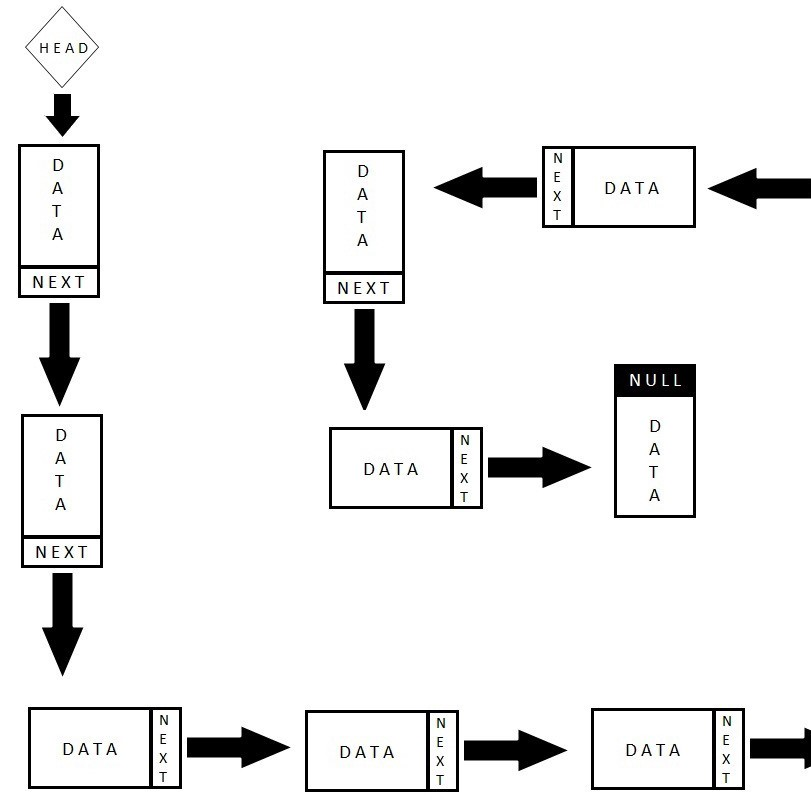

A user-interface which allows the user a menu of choices for a bank database application. The database contains the accountnumber, name, and address fields for each person.

Menu Options
The information is stored in a database which is a black box and can only be accessed by the user interface functions.

The following menu choices must be available:

Add a new record in the database
Print information about a record using the accountno as the key
Print all information in the database
Delete an existing record from the database using the accountno as a key
Quit the program.

For this project, I gained a lot of experience with linked list in C. This was my biggest and hardest project when I practice programming in C. 

